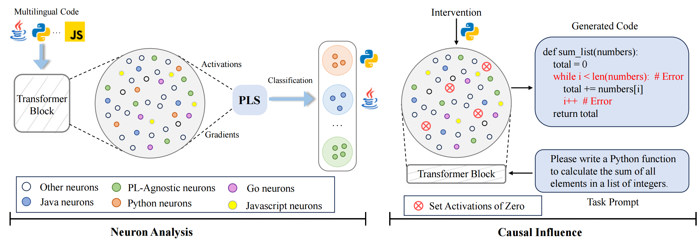

<div align="center">

# Neuron-Guided Interpretation of Code LLMs: Where, Why, and How?

Experiments, datasets, and scripts accompanying our paper.

</div>

## Overview

This repository provides the code and resources for neuron-level interpretability and its applications in code large language models (Code LLMs). We study where language-specific neurons live, why middle layers act as language-agnostic concept layers, and how these insights can improve downstream software engineering tasks.

We evaluate two strong Code LLMs (Llama-3.1-8B and Qwen2.5-Coder-32B) across five languages: C++, Java, Python, Go, and JavaScript. The repo is organized by research questions (RQ1–RQ3) with runnable scripts and example datasets/results.

<p align="center">
  
</p>


## Repository Structure

```
XLLM4SE/
├── code/                                          # Source code for all experiments
│   ├── RQ1/                                       # Language-specific neuron discovery and intervention
│   ├── RQ2/                                       # Concept layer analysis
│   │   ├── RSA/                                   # Representational Similarity Analysis
│   │   ├── AST_Probe_Analysis/                    # AST probing experiments
│   │   └── Rename/                                # Variable-renaming robustness tests
│   └── RQ3.*/                                     # Downstream task applications
│       ├── RQ3.1_Neuron_Guided_Finetuning/        # Neuron-guided and LoRA fine-tuning
│       ├── RQ3.2_Code_Clone/                      # Clone detection using layer representations
│       └── RQ3.3_Code_Summarization/              # Concept-layer transfer for summarization
│
├── datasets/                                      # Evaluation datasets
│   ├── humaneval-x/                               # Multilingual HumanEval-X for generation
│   ├── McEval/                                    # Instruction and generation sets
│   ├── CodeSearchNet/                             # Code summarization datasets
│   └── CodeNet/                                   # Code clone detection examples
│
├── results/                                       # Precomputed experimental results
│   ├── RQ1/                                       # Language-specific neuron analysis results
│   │   ├── Llama-3.1-8B/                          # Results for Llama model
│   │   └── Qwen2.5-coder-32B/                     # Results for Qwen model
│   ├── RQ2/                                       # Concept layer analysis results
│   │   ├── */AST/                                 # AST probing performance curves
│   │   ├── */rename/                              # Variable renaming similarity analysis
│   │   └── */RSA/                                 # Language pair similarity curves
│   └── RQ3/                                       # Downstream task results
│       ├── RQ3.1_Neuron_Guided_Finetuning/        # Fine-tuning performance
│       ├── RQ3.2_Code_clone/                      # Clone detection F1 scores
│       └── RQ3.3_Code_Summarization/              # Summarization BLEU scores
│
└── README.md                                      # Overview
```

For detailed usage and commands, see the README in each subdirectory:

- **RQ1**: [`code/RQ1/README.md`](code/RQ1/README.md)
- **RQ2**: [`code/RQ2/README.md`](code/RQ2/README.md)
- **RQ3.1**: [`code/RQ3.1_Neuron_Guided_Finetuning/README.md`](code/RQ3.1_Neuron_Guided_Finetuning/README.md)
- **RQ3.2**: [`code/RQ3.2_Code_Clone/README.md`](code/RQ3.2_Code_Clone/README.md)
- **RQ3.3**: [`code/RQ3.3_Code_Summarization/README.md`](code/RQ3.3_Code_Summarization/README.md)

## Experimental Results

### RQ1: Language-Specific Neuron Discovery
We identify and filter programming language-specific neurons through gradient analysis and feature attribution methods. Our experimental results show:
- Successfully identified language-specific neurons for each programming language (C++, Java, Python, Go, JavaScript)
- Achieved cross-lingual code generation control through neuron intervention experiments, validating neuron language-specificity
- Detailed neuron locations and intervention experiment results available in [`results/RQ1/`](results/RQ1/)

### RQ2: Concept Layer Analysis
We analyze why middle layers function as language-agnostic concept layers through three approaches:
- **RSA (Representational Similarity Analysis)**: Shows peak similarity between different language representations at middle layers
- **AST Probing**: Demonstrates highest accuracy for syntactic structure detection in middle layers
- **Variable Renaming Robustness**: Confirms middle layers are most robust to variable name changes
- Visualization results in [`results/RQ2/`](results/RQ2/) including performance curves and similarity heatmaps

### RQ3: Downstream Applications
We demonstrate practical applications of our findings:
- **RQ3.1 Neuron-Guided Fine-tuning**: Achieves comparable performance to LoRA with fewer parameters
- **RQ3.2 Code Clone Detection**: Leverages middle-layer representations for improved F1 scores
- **RQ3.3 Code Summarization**: Uses concept layers for effective cross-lingual transfer learning
- Performance metrics and comparisons available in [`results/RQ3/`](results/RQ3/)

## Datasets

- [`datasets/humaneval-x`](datasets/humaneval-x): Multilingual HumanEval-X for generation/evaluation
- [`datasets/McEval`](datasets/McEval): Instruction and generation sets for fine-tuning and sampling
- [`datasets/CodeSearchNet`](datasets/CodeSearchNet): Code summarization in multiple languages
- [`datasets/CodeNet`](datasets/CodeNet): Example code clone inputs

## Tips and Notes

- **GPU memory**: Some analyses (e.g., RQ1 gradients, RQ2 RSA/AST) are compute- and memory-intensive. Reduce sample size or leverage multi-GPU via `--device_map auto`.
- **Model support**: Scripts include tailored hooks for Llama and Qwen. Other models may work but are less tested.
